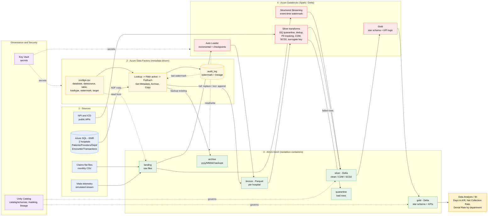

# Architecture Flow — Healthcare RCM Lakehouse

End-to-end data flow from sources to KPIs. The diagram below renders automatically on GitHub
(Mermaid). An ASCII version follows for any viewer that doesn't render Mermaid.

## Diagram (Mermaid)



## Flow in words

1. **Sources** → Azure SQL (EMR, 2 hospitals), monthly **claims** files, **NPI/ICD** APIs, vitals telemetry.
2. **ADF** reads `configs.csv` and, per hospital/table: checks the bronze folder, **archives** existing
   data (date-partitioned), then **full-replaces or incrementally appends** to **bronze** — recording each
   load (and the watermark) in **audit_log**.
3. **Databricks** brings claims in via **Auto Loader** and reference data via API into bronze, then
   transforms bronze → **silver** (DQ quarantine, dedup, PII masking, common data model, SCD2, surrogate
   key) and silver → **gold** (star schema + KPIs). A streaming job handles telemetry with event-time
   watermarks.
4. **Governance** is cross-cutting: **Unity Catalog** governs silver/gold (schemas, column masking,
   lineage) and **Key Vault** holds all secrets.
5. **Consumers** (analysts/BI) read the **gold** KPIs: Days in A/R, Net Collection Rate, Denial Rate by
   department.

## ASCII fallback

```
 SOURCES                 INGESTION (ADF)             STORAGE (ADLS medallion)        COMPUTE (Databricks)        CONSUMERS
 -------                 ---------------             ------------------------        --------------------        ---------
 Azure SQL (EMR) ─copy─► configs.csv ─► Lookup/      landing ─► bronze (Parquet) ─► Silver transforms ─► silver
   2 hospitals            ForEach: GetMeta,            ▲           │ per hospital      DQ/dedup/mask/             (Delta)
 Claims files ──────────► Archive, Copy ──────────────┘           │                   CDM/SCD2/SK        │
 NPI/ICD APIs ─────────────────────────────────────────────────► bronze ◄─ AutoLoader/API               ▼
 Telemetry ─► landing ─► Structured Streaming ──────────────────► silver                       gold (Delta) ─► Analysts/BI
                          │                                        │   ▲                         star + KPIs       Days in A/R
                          ▼                                   quarantine│                                          NCR
                       audit_log ◄─ watermark ───────────────────────┘                                            Denial Rate
                       (lineage)                          archive (yyyy/MM/dd)

 Cross-cutting:  Key Vault (secrets) ──► ADF + Databricks      Unity Catalog (governance, masking, lineage) ──► silver + gold
```

## Legend
- **Cylinders/blue** = sources. **Yellow** = ADF ingestion/orchestration. **Green** = ADLS medallion
  containers. **Red** = Databricks compute. **Purple** = governance/security. **Gold** = consumers.
- Solid arrows = data movement. Dotted arrows = control/governance (secrets, watermark reads, access).
